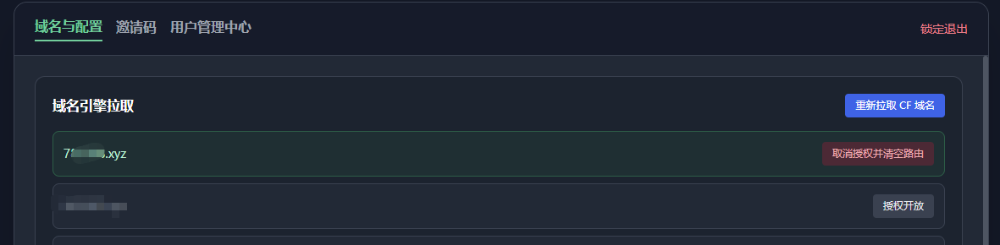
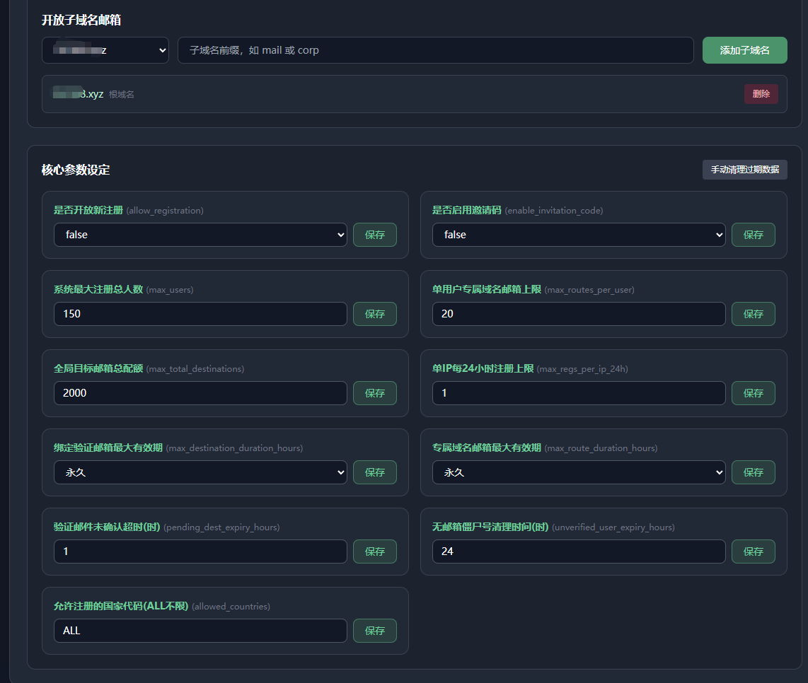
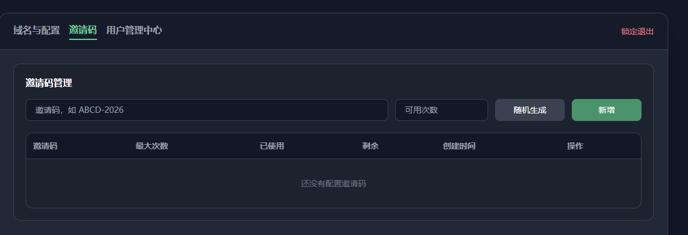
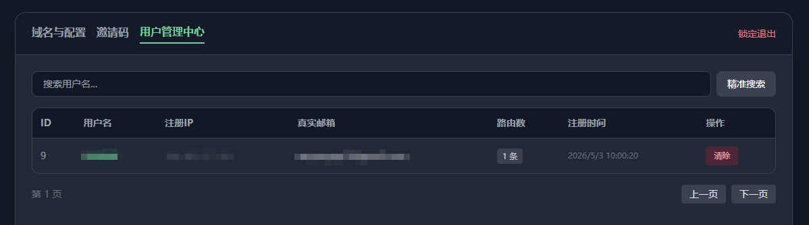
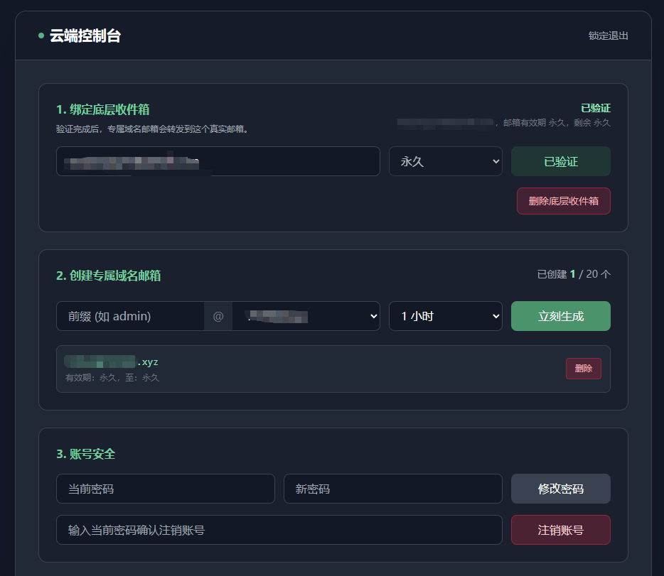
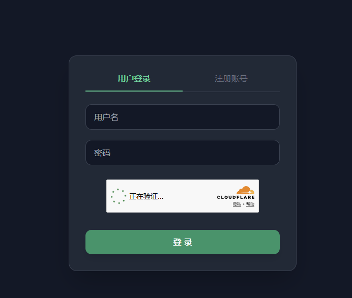

# CF-email-forwarding
基于Cloudflare Workers、邮件路由和D1数据库构建的无服务器、多网关的邮件转发服务。用于搭建临时或者永久域名邮箱。

# 以下内容为ai生成的简介/部署教程

# 🚀 云端专属邮件路由系统

## 📖 项目概述
本项目是一个基于 **Cloudflare Workers** 和 **D1 数据库** 构建的无服务器（Serverless）、多租户“无限别名邮件隐私护盾”系统。

它将 Cloudflare 原本仅限单人使用的 Email Routing 底层能力进行了深度封装与 SaaS 化改造。站长或团队可以零成本搭建一个供多人协作的虚拟邮箱分配平台。用户只需在控制台点按几下，即可生成带有专属域名（含子域名）的虚拟邮箱，所有邮件将极速、安全、无痕地穿透转发至用户的真实邮箱（如 QQ、网易、Gmail 等）。

---

## 📸 系统截图

 
  




---

## ✨ 核心功能与强大的参数管控 (Admin Configs)

本系统拥有一个**“上帝视角”的超级管理员后台**，支持丰富的全局参数动态热更，且立即对所有用户生效。

### 🛡️ 注册与风控管理
* **是否开放新注册 (`allow_registration`)**：`true/false` 动态切换，随时开启或关闭系统大门。
* **是否启用邀请码 (`enable_invitation_code`)**：`true/false`。开启后，用户注册必须输入管理员在后台生成的邀请码（支持设定每个码的使用次数），完美实现小圈子私有化运营。
* **单IP每24小时注册上限 (`max_regs_per_ip_24h`)**：硬核防刷机制，防止脚本恶意注册。
* **允许注册的IP国家 (`allowed_countries`)**：支持填入指定的国家代码进行地域屏蔽，默认 `ALL` 不设限。

### 📦 资源与配额分配
* **系统最大注册总人数 (`max_users`)**：控制平台总规模，避免资源耗尽。
* **全局目标邮箱总配额 (`max_total_destinations`)**：全站允许绑定的真实收件箱上限。
* **单用户专属域名邮箱上限 (`max_routes_per_user`)**：控制每个用户最多能生成的虚拟别名数量。

### ⏱️ 全自动化生命周期 (Cron 清理机制)
* **绑定验证邮箱最大有效期 (`max_destination_duration_hours`)**：管理员可限定底层邮箱绑定的最长有效期（可选 `1小时` 至 `永久`），到期后系统自动解除绑定。
* **专属域名邮箱最大有效期 (`max_route_duration_hours`)**：限定用户生成虚拟地址时的最长有效期（最高不能超过底层邮箱的有效期）。
* **验证邮件未确认超时 (`pending_dest_expiry_hours`)**：发送验证邮件后长时间未点击确认的“占坑记录”，到点自动回收。
* **无邮箱僵尸号清理时间 (`unverified_user_expiry_hours`)**：注册后迟迟不绑定真实邮箱的僵尸账号，到点自动注销，释放名额。

---

## 🛠️ 部署指南 (Deployment)

本系统完全基于 Cloudflare 生态，**零服务器成本，免维护**。请严格按照以下步骤进行初始化。

### 准备工作
1. 一个 [Cloudflare](https://dash.cloudflare.com/) 账号。
2. 将域名托管在 Cloudflare，并在左侧菜单开启 **Email Routing (电子邮件路由)** 功能。
3. 申请免费的 [Turnstile 人机验证](https://dash.cloudflare.com/?to=/:account/turnstile)，获取 `Site Key` 和 `Secret Key`。
4. 申请高权限的 **API Token**（右上角头像 -> My Profile -> API Tokens -> Create Token -> Custom token）。**具体权限要求请务必查看底部的附录。**

### 第一步：创建 D1 数据库并建表
1. 进入 Cloudflare 控制台 -> **Workers & Pages** -> **D1**，创建数据库（如命名为 `email-router-db`）。
2. 进入数据库的 **Console (控制台)**，**逐条**执行以下 SQL 语句：
```sql
-- 1. 系统配置表
CREATE TABLE IF NOT EXISTS sys_config (key TEXT PRIMARY KEY, value TEXT NOT NULL);

-- 2. 可选域名表
CREATE TABLE IF NOT EXISTS domains (id INTEGER PRIMARY KEY AUTOINCREMENT, domain TEXT NOT NULL UNIQUE, zone_id TEXT NOT NULL);

-- 3. 用户账号表
CREATE TABLE IF NOT EXISTS users (id INTEGER PRIMARY KEY AUTOINCREMENT, username TEXT UNIQUE NOT NULL, password TEXT NOT NULL, reg_ip TEXT, created_at DATETIME DEFAULT CURRENT_TIMESTAMP);

-- 4. 真实目标邮箱表
CREATE TABLE IF NOT EXISTS user_destinations (id INTEGER PRIMARY KEY AUTOINCREMENT, user_id INTEGER UNIQUE, cf_address_id TEXT, email TEXT NOT NULL, status TEXT DEFAULT 'pending', expires_at DATETIME, duration_hours TEXT, created_at DATETIME DEFAULT CURRENT_TIMESTAMP);

-- 5. 虚拟邮件路由表
CREATE TABLE IF NOT EXISTS email_routes (id INTEGER PRIMARY KEY AUTOINCREMENT, user_id INTEGER, cf_rule_id TEXT, tag TEXT, domain_id INTEGER, status TEXT DEFAULT 'active', expires_at DATETIME, duration_hours TEXT, created_at DATETIME DEFAULT CURRENT_TIMESTAMP);

-- 6. 会话状态表
CREATE TABLE IF NOT EXISTS sessions (token TEXT PRIMARY KEY, user_id INTEGER, role TEXT DEFAULT 'user', expires_at DATETIME);

-- 7. 邀请码表
CREATE TABLE IF NOT EXISTS invitation_codes (code TEXT PRIMARY KEY, max_uses INTEGER NOT NULL, used_count INTEGER DEFAULT 0, created_at DATETIME DEFAULT CURRENT_TIMESTAMP);
```

*(💡 提示：系统代码自带 Auto-Patch 机制，你只需建立空表，首次访问时系统会自动向 `sys_config` 写入默认参数)*

### 第二步：部署 Worker 代码并绑定数据库
1. 在 **Workers & Pages** 中点击 **Create Worker**，命名后点击 Deploy。
2. 点击 **Edit code**，清空原有内容，将本项目的 JavaScript 代码粘贴进去并部署。
3. 返回 Worker 设置页 -> **Settings** -> **Bindings**。
4. 添加 D1 绑定：变量名填 `DB`，数据库选择你刚才创建的 `email-router-db`，保存。

### 第三步：配置环境变量 (Variables and Secrets)
在 Worker 的 **Settings** -> **Variables and Secrets** 中，添加以下变量：

| 变量名 (Variable) | 示例 / 说明 | 是否加密 (Secret) |
| :--- | :--- | :--- |
| `CF_ACCOUNT_ID` | Cloudflare 主页右下角的 Account ID | 否 |
| `CF_API_TOKEN` | 准备工作里申请的高权限 API Token | **是** |
| `TURNSTILE_SITEKEY` | 准备工作里申请的 Site Key | 否 |
| `TURNSTILE_SECRET` | 准备工作里申请的 Secret Key | **是** |
| `ADMIN_USERNAME` | 自定义超级管理员账号 (如: `admin`) | 否 |
| `ADMIN_PASSWORD` | 自定义超级管理员密码 | **是** |
| `ADMIN_PATH` | 自定义后台隐藏入口路径 (如: `/admin-panel`) | 否 |

> **⚠️ 极度重要**：配置完所有变量并保存后，**请一定要再去点击一次 "Edit code" -> "Deploy"**，强制系统重载最新配置！

### 第四步：激活清道夫 (Cron Trigger)
1. 在 Worker 设置页进入 **Triggers** 选项卡。
2. 找到 **Cron Triggers**，点击 **Add Cron Trigger**。
3. 输入 `*/5 * * * *` （代表每 5 分钟执行一次清理扫描）。
4. 保存后，系统的自动化生命周期管理即刻生效！

### 🚀 第五步：开始使用
1. **超级管理员配置**：访问 `https://你的worker域名.workers.dev/你的ADMIN_PATH`，输入账号密码登录。点击“开放授权”你的可用域名。
2. **普通用户访问**：分享你的 Worker 根目录链接，用户即可自由体验丝滑的无限别名邮件服务！

---

### 📌 附录：如何申请正确的 CF_API_TOKEN (必看)

为了保证系统能够顺利拉取域名并动态下发路由规则，请确保授予 API Token 以下权限。

⚠️ **特别提示**：如果你需要使用**配置子域邮箱功能**（允许系统在你的主域名下动态创建 `mail.yourdomain.com` 这种子域名），必须额外配置第四条 **Zone Settings (区域设置)** 的编辑权限，否则系统无法写入配置！

1. `Account` (帐户) -> `Email Routing Addresses` (电子邮件路由地址) -> **`Edit` (编辑)**
2. `Zone` (区域) -> `Email Routing Rules` (电子邮件路由规则) -> **`Edit` (编辑)**
3. `Zone` (区域) -> `Zone` (区域) -> **`Read` (读取)** 
4. `Zone` (区域) -> `Zone Settings` (区域设置) -> **`Edit` (编辑)** *(开启配置子域邮箱功能必备)*

> 在下方的 **Zone Resources (区域资源)** 中，必须选择 `Include (包括)` -> `All zones (所有区域)`。生成 Token 后填入 Worker 环境变量即可。
